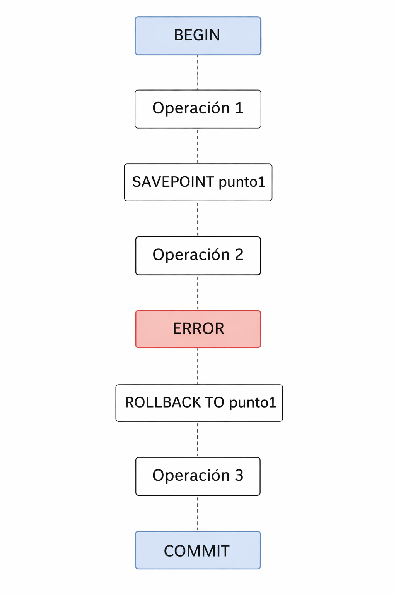

# Práctica adicional. Uso de SAVEPOINT y ROLLBACK parcial

## Objetivo

Al finalizar la práctica, serás capaz de:

* Utilizar **SAVEPOINT** dentro de una transacción.
* Realizar **rollback parcial** sin perder toda la transacción.
* Comprender cómo PostgreSQL permite **recuperar errores dentro de una transacción larga**.

<br/><br/>

## Duración aproximada

15 minutos

<br/><br/>

## Objetivo visual

Comprender que dentro de una transacción se pueden crear **puntos de recuperación intermedios**.




<br/><br/>

# Instrucciones

## Tarea 1. Preparar el entorno

Desde el escritorio de Linux abre una terminal y conéctate a PostgreSQL.

```bash
sudo -i -u postgres psql
```

Crea una tabla para la práctica.

```sql
DROP TABLE IF EXISTS cuentas;

CREATE TABLE cuentas_demo (
   id SERIAL PRIMARY KEY,
   nombre TEXT,
   saldo NUMERIC
);
```

Inserta datos iniciales.

```sql
INSERT INTO cuentas_demo (nombre, saldo)
VALUES
('Paco',1000),
('Hugo',1000),
('Luis',500);
```

Verifica los datos.

```sql
SELECT nombre, saldo FROM cuentas_demo;
```


<br/><br/>

# Tarea 2. Uso de SAVEPOINT

Inicia una transacción.

```sql
BEGIN;
```

Realiza una primera operación.

```sql
UPDATE cuentas_demo
SET saldo = saldo - 200
WHERE nombre = 'Paco';
```

Ahora crea un **punto de control dentro de la transacción**.

```sql
SAVEPOINT punto_transferencia;
```

Realiza una segunda operación.

```sql
UPDATE cuentas_demo
SET saldo = saldo + 200
WHERE nombre = 'Hugo';
```

Consulta los valores dentro de la transacción.

```sql
SELECT * FROM cuentas_demo;
```

 ¿Cuál sería el resultado esperado?

<br/><br/>

# Tarea 3. Simulación de error y rollback parcial

Ahora intenta una operación incorrecta.

```sql
UPDATE cuentas_demo
SET saldo = saldo + 200
WHERE nombre = 'Carlos';
```

Supón que detectas un problema en la operación anterior y decides regresar al punto seguro.

```sql
ROLLBACK TO SAVEPOINT punto_transferencia;
```

Esto **revierte solamente las operaciones realizadas después del SAVEPOINT**.

Verifica el estado de la tabla.

```sql
SELECT * FROM cuentas_demo;
```

Resultado esperado:

```
Paco  -> 800
Hugo   -> 1000
Luis  -> 500
```

Observa que:

* El retiro de **Paco** se mantiene.
* El depósito a **Hugo** fue revertido.

<br/><br/>

# Tarea 4. Continuar la transacción

Ahora realiza una nueva operación correcta.

```sql
UPDATE cuentas_demo
SET saldo = saldo + 200
WHERE nombre = 'Luis';
```

Verifica nuevamente los datos.

```sql
SELECT * FROM cuentas_demo;
```

Resultado esperado dentro de la transacción:

```
Paco  -> 800
Hugo   -> 1000
Luis  -> 700
```

Confirma la transacción.

```sql
COMMIT;
```

<br/><br/>

# Resultado esperado

Después del **COMMIT**, el estado final será:

```
Paco  -> 800
Hugo   -> 1000
Luis  -> 700
```

Esto demuestra que:

* **SAVEPOINT permite crear puntos de recuperación dentro de una transacción.**
* **ROLLBACK TO SAVEPOINT revierte solo una parte de la transacción.**
* Las operaciones anteriores al SAVEPOINT **no se pierden**.

<br/><br/>

## Conclusión

Los **SAVEPOINT** permiten manejar errores dentro de transacciones complejas sin necesidad de cancelar toda la operación. Esto es útil en aplicaciones donde múltiples cambios deben ejecutarse de manera controlada y donde es necesario recuperar el estado de la base de datos ante fallos parciales.

<br/><br/>
