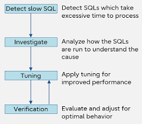

# Práctica 3. Afinación de SQL
## Objetivo
Al finalizar la práctica, serás capaz de:
- Aplicar funciones de agregación y escalares en consultas SQL sobre PostgreSQL.

## Duración aproximada
- 90 minutos.

## Objetivo visual
En los siguientes ejercicios se verá como analizar y mejorar el desempeño de las sentencias SQL en PostgreSQL.


## Instrucciones

### Tarea 1. Comparar el plan de ejecución con y sin índice

**Paso 1.** Crea los elementos necesarios para el ejercicio e inserta los datos.

```sql
CREATE TABLE productos (
  id SERIAL PRIMARY KEY,
  nombre TEXT,
  categoria TEXT,
  precio NUMERIC
);
INSERT INTO productos(nombre, categoria, precio)
SELECT 'Producto ' || i, 'Categoria ' || (i % 10), i*10
FROM generate_series(1, 100000) AS i;
```

**Paso 2.** Ejecuta el primer `ANALYZE`.

```sql
EXPLAIN ANALYZE SELECT * FROM productos WHERE categoria = 'Categoria 5';
```

**Paso 3.** Crea el índice.
```sql
CREATE INDEX idx_categoria ON productos(categoria);
```

**Paso 4.** Ejecuta `ANALYZE` con el índice y compara los resultados.

```sql
EXPLAIN ANALYZE SELECT * FROM productos WHERE categoria = 'Categoria 5';
```
Compara `Seq Scan` con `Index Scan`.


### Tarea 2. Afinar una consulta lenta reescribiéndola

**Paso 1.** Consulta lenta (subconsulta correlacionada).
```sql
SELECT nombre FROM productos
WHERE categoria IN (
  SELECT categoria FROM productos WHERE precio > 500000
);
```

**Paso 2.** Consulta optimizada con `JOIN`.
```sql
SELECT DISTINCT p1.nombre
FROM productos p1
JOIN productos p2 ON p1.categoria = p2.categoria
WHERE p2.precio > 500000;
```

**Paso 3.** Compara los resultados con `ANALYZE`.


### Tarea 3. Crear una vista materializada para acelerar reportes

**Paso 1.** Crea la vista.
```sql
CREATE MATERIALIZED VIEW resumen_categoria AS
SELECT categoria, COUNT(*) AS total_productos, AVG(precio) AS precio_promedio
FROM productos
GROUP BY categoria;
```

**Paso 2.** Consulta.
```sql
SELECT * FROM resumen_categoria ORDER BY precio_promedio DESC LIMIT 5;
```

**Paso 3.** Refresca la vista y comprueba los cambios.
```sql
REFRESH MATERIALIZED VIEW resumen_categoria;
```

### Tarea 4. Forzar el uso de `Nested Loop` y analizar el rendimiento

**Paso 1.** Establece el ambiente del ejercicio.

```sql
SET enable_hashjoin = off;
SET enable_mergejoin = off;
```

**Paso 2.** Verifica con `ANALYZE` el comportamiento del `nested loop`.

```sql
EXPLAIN ANALYZE
SELECT p1.nombre, p2.nombre
FROM productos p1
JOIN productos p2 ON p1.categoria = p2.categoria
WHERE p1.precio < 100 AND p2.precio > 1000;
```

**Paso 3.** Restablece variables de configuración.
```sql
RESET enable_hashjoin;
RESET enable_mergejoin;
RESET enable_nestloop;
```

### Tarea adicional (opcional). Uso de `pg_stat_statements` para detectar consultas costosas

Utiliza la extensión `pg_stat_statements` para capturar y analizar el rendimiento de las consultas ejecutadas, identificando aquellas con mayor costo total, frecuencia o tiempo promedio.

**Paso 1.** Habilita `pg_stat_statements`.

Edita el archivo `postgresql.conf` (si tienes permisos de superusuario).

En Ubuntu, normalmente en:
`sudo nano /etc/postgresql/15/main/postgresql.conf`.

Agrega o descomenta:
`shared_preload_libraries = 'pg_stat_statements'`.

Reinicia PostgreSQL:
`sudo systemctl restart postgresql`.

**Paso 2.** Crea la extensión en la base de datos.
```sql
CREATE EXTENSION IF NOT EXISTS pg_stat_statements;
```

**Paso 3.** Ejecuta algunas consultas para que se registren.

Consultas de prueba:
```sql
SELECT COUNT(*) FROM productos WHERE precio > 500;
SELECT AVG(precio) FROM productos WHERE categoria = 'Categoria 3';
SELECT * FROM productos WHERE nombre ILIKE '%123%';
```

**Paso 4.** Consulta estadísticas.

```sql
SELECT query, calls, total_time, mean_time, rows
FROM pg_stat_statements
ORDER BY total_time DESC
LIMIT 5;
```

**Columnas clave**
- `query`: la consulta que se ejecutó.
- `calls`: veces que se ejecutó.
- `total_time`: suma del tiempo total.
- `mean_time`: tiempo promedio por llamada.
- `rows`: total de filas devueltas.

**Paso 5.** Puedes reiniciar el contador de estadísticas (opcional).

```sql
SELECT pg_stat_statements_reset();
```

**Recomendaciones**
- Úsalo junto con `auto_explain` para registrar planes automáticos en el `log`.
- Ideal para entornos de desarrollo y pruebas antes de producción.
- No dejes `pg_stat_statements` activado sin monitoreo en bases sensibles si hay preocupación por `overhead` mínimo `(~1-2%)`.

## Resultado esperado
