# Demo/POC 3.4 Explorando EXPLAIN en PostgreSQL

<br/><br/>

## Objetivo

* Entender **cómo PostgreSQL ejecuta consultas** y cómo interpretar diferentes variantes de `EXPLAIN` para analizar rendimiento, uso de índices, I/O y planificación.

* Tener imagenes de los planes de ejecución sin tener que ejecutar las consultas.

<br/><br/>

### Preparación del escenario

#### Crear tabla

```sql

DROP TABLE IF EXISTS empleados;

CREATE TABLE empleados (
    id SERIAL PRIMARY KEY,
    nombre TEXT,
    departamento_id INT,
    salario NUMERIC,
    fecha_ingreso DATE
);

```

<br/><br/>

#### Insertar volumen de datos 

```sql

INSERT INTO empleados (nombre, departamento_id, salario, fecha_ingreso)
SELECT 
    'Empleado ' || i,
    (random() * 1000)::int,
    (random() * 50000)::numeric,
    CURRENT_DATE - (random() * 3650)::int
FROM generate_series(1, 500000) i;

```

<br/><br/>

#### Crear índice 

```sql

CREATE INDEX idx_emp_depto ON empleados(departamento_id);

```

<br/><br/>

#### Actualizar estadísticas

```sql

ANALYZE empleados;

```

<br/><br/>

### Queries base 

```sql

SELECT count(*) FROM empleados;

SELECT * FROM empleados LIMIT 5;
```

>**Notas:**
* `count(*)` suele usar Seq Scan o parallel
* `limit 5` puede cortar ejecución temprano

<br/><br/>

### Casos clave con EXPLAIN

####  1. EXPLAIN ANALYZE básico

```sql

EXPLAIN ANALYZE 
SELECT * 
FROM empleados 
WHERE departamento_id > 100;

```

#### Qué podríamos observar

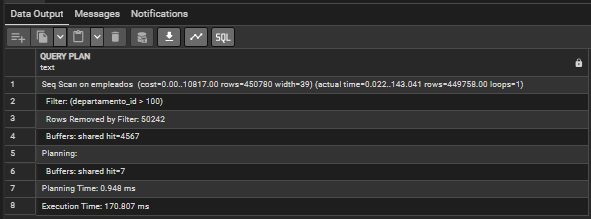

<br/>

* `actual time` tiempo real
* `rows` filas devueltas vs estimadas
* Tipo de scan:
  * Seq Scan implica muchos datos
  * Index Scan implica ser selectivo


<br/><br/>

###  2. ANALYZE + BUFFERS 

```sql

EXPLAIN (ANALYZE, BUFFERS) 
SELECT * 
FROM empleados 
WHERE departamento_id > 1000;

```

<br/>

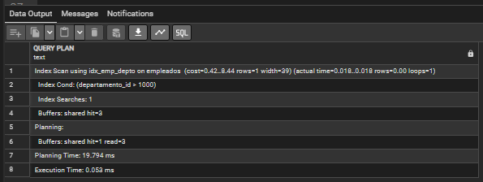

<br/>

>**Notas:**

* `shared hit` implica datos en memoria (cache)
* `shared read` implica lectura de disco (operación costosa)
* ¿Esto fue rápido porque estaba en RAM o porque el plan es bueno?

<br/><br/>

### 3. VERBOSE

```sql

EXPLAIN (VERBOSE) 
SELECT nombre 
FROM empleados;

```

<br/>

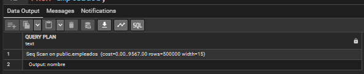

<br/>

### Muestra:

* Columnas reales usadas
* Alias internos
* Expansión del plan
* Ideal para explicar cómo el planner interpreta la consulta.

<br/><br/>

## 4. COSTS OFF (para enseñar limpio)

```sql
EXPLAIN (COSTS OFF) 
SELECT * FROM empleados;
```

<br/>

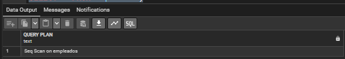

<br/>

Útil cuando:

* No quieres distraer con números
* Solo quieres explicar estructura del plan

<br/><br/>

## 5. ANALYZE sin TIMING

```sql

EXPLAIN (ANALYZE, TIMING OFF) 
SELECT * FROM empleados;

```

<br/>

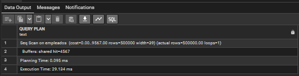

<br/>

### Para qué sirve:

* Reduce overhead de medición
* Mejora precisión en queries grandes

<br/><br/>

## 6. ANALYZE completo

```sql
EXPLAIN ANALYZE 
SELECT * FROM empleados;
```

<br/>

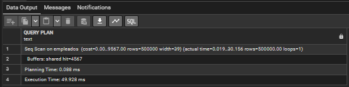

<br/>

* EXPLAIN realiza la estimación
* ANALYZE realiza la ejecución real

<br/><br/>

## 7. SUMMARY OFF

```sql

EXPLAIN (ANALYZE, SUMMARY OFF) 
SELECT * FROM empleados;

```

<br/>

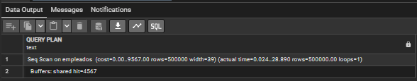

<br/>

>**Nota:**
* Planning Time
* Execution Time

Útil cuando quieres enfocarte solo en operadores

<br/><br/>

## 8. FORMAT JSON

```sql

EXPLAIN (FORMAT JSON) 
SELECT * FROM empleados;

```

<br/>

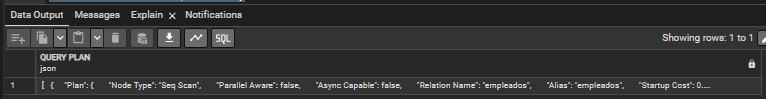

<br/>

>**Nota:**
* Usado por herramientas como:
  * pgAdmin
  * visualizadores de planes

<br/><br/>

## 9. FORMAT XML

```sql

EXPLAIN (FORMAT XML) 
SELECT * FROM empleados;

```

<br/>

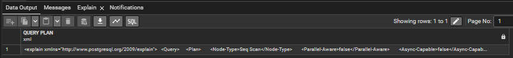

<br/>

Menos común, pero útil para integración enterprise

<br/><br/>

## 10. Caso completo 

```sql

EXPLAIN (ANALYZE, BUFFERS, VERBOSE) 
SELECT * 
FROM empleados 
WHERE departamento_id > 1000;

```

<br/>

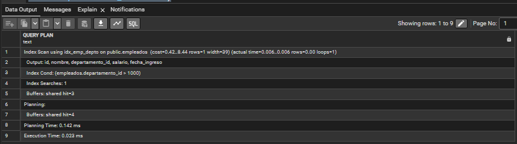

<br/>


* Plan elegido
* Estadísticas
* Uso de índice
* Uso de cache
* Columnas usadas

<br/><br/>

## 11. COSTS + VERBOSE

```sql
EXPLAIN (COSTS, VERBOSE) 
SELECT * 
FROM empleados 
WHERE departamento_id > 1000;
```


<br/>

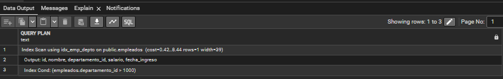

<br/>


* Decisión del planner (cost-based)

<br/><br/>

## 12. JSON + ANALYZE + BUFFERS

```sql
EXPLAIN (ANALYZE, BUFFERS, FORMAT JSON) 
SELECT * 
FROM empleados 
WHERE departamento_id > 1000;
```

<br/>

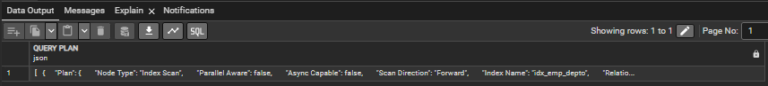

<br/>


Ideal para:
* Exportar
* Automatizar análisis
* Comparar planes programáticamente

<br/><br/>

## Momento clave en clase 

### Forzar comparación con y sin índice

```sql

SET enable_seqscan = off;

EXPLAIN ANALYZE 
SELECT * FROM empleados WHERE departamento_id = 10;

```

Luego:

```sql

SET enable_seqscan = on;

```

<br/>

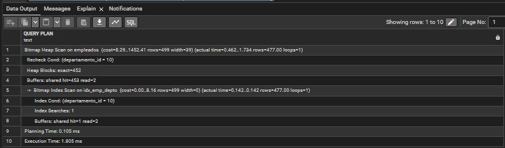

<br/>


* Mismo query
* Diferente plan

<br/><br/>

### Tabla resumen 

| Variante        | ¿Para qué sirve?         | Cuándo usar        |
| --------------- | ------------------------ | ------------------ |
| EXPLAIN         | Ver plan estimado        | Diseño inicial     |
| ANALYZE         | Medir ejecución real     | Performance real   |
| BUFFERS         | Ver uso de memoria/disco | Diagnóstico I/O    |
| VERBOSE         | Ver detalle interno      | Enseñanza/debug    |
| COSTS OFF       | Simplificar salida       | Explicar conceptos |
| TIMING OFF      | Evitar overhead          | Queries grandes    |
| SUMMARY OFF     | Quitar resumen           | Análisis detallado |
| FORMAT JSON/XML | Integración herramientas | Automatización     |

<br/><br/>

>**Nota:**
> EXPLAIN no es solo ver el plan… es entender *por qué PostgreSQL tomó esa decisión*, si fue correcta, y si el problema es el plan, los datos, la configuración del clúster o el hardware.

