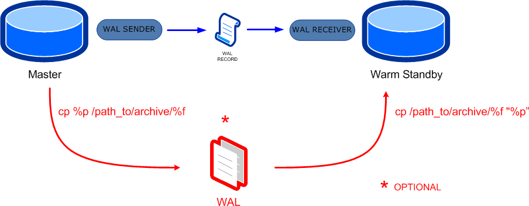

# Práctica 5. Replicación
## Objetivo
Al finalizar la práctica, serás capaz de:
-  Practicar lo que es la replicación lógica para una mejor disponibilidad de la aplicación.

## Duración aproximada
- 120 minutos.

## Objetivo visual
En la siguiente práctica, verás cómo realizar una replicación lógica de base de datos con PostgreSQL.



## Instrucciones

### Tarea 1. Configurar la replicación del maestro-esclavo local

**Requisitos**
-	PostgreSQL instalado (versión 13 o superior recomendada).
-	Dos directorios para los datos:

    `/var/lib/postgresql/maestro` (puede ser el `main` de un `cluster` normal).

    `/var/lib/postgresql/esclavo` (puedes llamarle `replica`).
-	Puertos separados: 5432 (maestro), 5433 (esclavo).

**Paso 1.** Crea los directorios de datos.
```
sudo mkdir -p /var/lib/postgresql/maestro
sudo mkdir -p /var/lib/postgresql/esclavo
sudo chown -R postgres:postgres /var/lib/postgresql
```
**Paso 2.** Inicializa el maestro.
```
sudo -u postgres /usr/lib/postgresql/16/bin/initdb -D /var/lib/postgresql/maestro
```

**Paso 3.** Configura el `postgresql.conf` del maestro.

Edita el siguiente archivo: `sudo nano /var/lib/postgresql/maestro/postgresql.conf`.

Agrega o ajusta:
```
port = 5432
wal_level = replica
max_wal_senders = 10
wal_keep_size = 64MB
listen_addresses = '*'
```

**Paso 4.** Configura el `pg_hba.conf` del maestro.

```
sudo nano /var/lib/postgresql/maestro/pg_hba.conf
```


Agrega:

```
host replication replicador 127.0.0.1/32 md5
```

**Paso 5.** Crea un usuario de replicación (si no existe) y otorga privilegios.

Inicia el maestro en segundo plano:
```
sudo -u postgres /usr/lib/postgresql/16/bin/pg_ctl -D /var/lib/postgresql/maestro -l maestro.log start 
```
Crea el usuario replicador `psql -p 5432 -U postgres`

```sql
CREATE ROLE replicador WITH REPLICATION LOGIN ENCRYPTED PASSWORD 'abc123';
GRANT USAGE ON SCHEMA public TO replicador;
GRANT SELECT ON ALL TABLES IN SCHEMA public TO replicador;
```

**Paso 6.** Inicializa el esclavo con `pg_basebackup`.

Primero, detén al maestro si necesitas limpiar datos en el esclavo:
```
sudo -u postgres /usr/lib/postgresql/16/bin/pg_ctl -D /var/lib/postgresql/maestro stop
```
Luego, ejecuta:
```
sudo -u postgres /usr/lib/postgresql/16/bin/pg_basebackup
  -h 127.0.0.1 -p 5432 -D /var/lib/postgresql/esclavo 
  -U replicador -Fp -Xs -P -R
```
Esto creará un archivo `standby.signal` automáticamente.


**Paso 7.** Configura el esclavo (`postgresql.conf`).
```
sudo nano /var/lib/postgresql/esclavo/postgresql.conf
```

Asegúrate de tener:
```
port = 5433
hot_standby = on
```

**Paso 8.** Inicia al maestro y al esclavo.
```
sudo -u postgres /usr/lib/postgresql/15/bin/pg_ctl -D /var/lib/postgresql/maestro -l maestro.log start
sudo -u postgres /usr/lib/postgresql/15/bin/pg_ctl -D /var/lib/postgresql/esclavo -l esclavo.log start
```

**Paso 9.**  Verifica la replicación.
```
psql -p 5432 -c "SELECT * FROM pg_stat_replication;"
```

**Paso 10.** Comprueba que el maestro y el esclavo están en ejecución desde la línea de comando del usuario `postgres`.
```
pg_lsclusters
```

### Tarea 2. Probar `failover` manual
Simula la caída del maestro y promueve el esclavo a maestro.

**Paso 1.** Detén al maestro.
```
sudo -u postgres /usr/lib/postgresql/15/bin/pg_ctl -D /var/lib/postgresql/maestro stop
```

**Paso 2.** Promueve al esclavo.
```
sudo -u postgres /usr/lib/postgresql/15/bin/pg_ctl -D /var/lib/postgresql/esclavo promote
```

**Paso 3.** Valida la promoción.

Intenta conectarte y escribe en la réplica, ahora promovida:
```
psql -p 5433
```
```sql
CREATE TABLE test_failover(id INT);
INSERT INTO test_failover VALUES (1);
SELECT * FROM test_failover;
```
## Resultado esperado
**Monitoreo del estado de la replicación**

```sql
Ver slots de replicación (Publisher)
SELECT * FROM pg_replication_slots;
```
```sql
Ver estado de la suscripción (Subscriber)
SELECT * FROM pg_stat_subscription;
 ```
```
 Posibles errores y soluciones

❌ Error: "No se pudo iniciar la replicación"
✔ Verifica que wal_level = logical en el Publisher.
✔ Confirma que el usuario replicator existe y tiene permisos.
❌ Datos no aparecen en el Subscriber
✔ Ejecuta en el Subscriber:
ALTER SUBSCRIPTION sub_clientes REFRESH PUBLICATION;
```
 
### Conclusión
¡Has configurado exitosamente la replicación lógica en PostgreSQL 16 en un entorno local!
```
- Publisher (5432): envía cambios.
- Subscriber (5433): recibe cambios en tiempo real.
```
