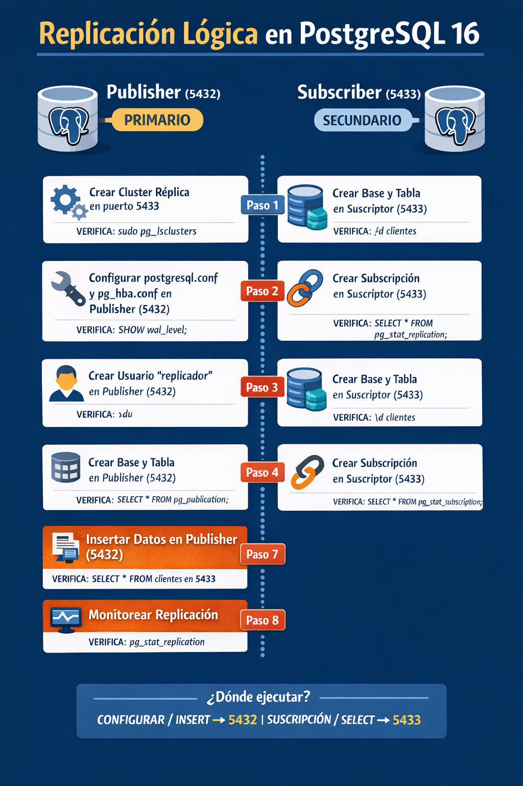

# Práctica 5.1 Replicación Lógica en PostgreSQL 16

## Objetivo

Configurar replicación lógica entre dos instancias de PostgreSQL en la misma máquina:

* **Publisher (Primario)**  puerto **5432**
* **Subscriber (Secundario)**  puerto **5433**

## Objectivo Visual



<br/><br/>

## Instrucciones

### Paso 1: Crear el cluster Subscriber

Ejecutar en sistema operativo

```bash

sudo pg_createcluster 16 replica --start --port=5433

```

<br/><br/>

### Validación

```bash
sudo pg_lsclusters
```

>**Nota:** 
> 5432  main  online
> 5433  replica  online

<br/><br/>

## Paso 2: Configurar Publisher (5432)

### Verifica la ruta de los archivos de configuración

```sql

SHOW hba_file;

SHOW config_file;

```

### Ejecutar en sistema operativo. Editar configuración (nano o vi o vim):

```bash
sudo nano /etc/postgresql/16/main/postgresql.conf
```

### Asegurar:

```conf
wal_level = logical
max_replication_slots = 10
max_wal_senders = 10
```

### Editar acceso:

```bash
sudo nano /etc/postgresql/16/main/pg_hba.conf
```

### Agregar al usuario que replicara [ej. replicador o replicador2]:

```conf
host    all     replicador      127.0.0.1/32          md5
```


### Reiniciar:

```bash

sudo systemctl restart postgresql@16-main

```

### Validación, conectarse al Publisher (primario 5432)

```bash
sudo -u postgres psql -p 5432
```

```sql
-- resultado esperado logical
SHOW wal_level;

-- Valores mayores a cero

SHOW max_replication_slots;
SHOW max_wal_senders;
```


<br/><br/>

## Paso 3: Crear usuario y objetos en Publisher

### Primario/Publisher o en **5432**

```sql
-- 5432
show port;

CREATE ROLE replicador WITH REPLICATION LOGIN PASSWORD 'abc123';

```

 

### Validación

```sql
\du
```

>**Nota:** Debe aparecer el rol replicador[2] con atributo **Replication**

 

### Crear base de datos:

```sql
CREATE DATABASE db_replica;
```


### Conectarse:

```sql
\c db_replica

-- sin tablas
\dt

```

### Crear tabla:

```sql
CREATE TABLE clientes (
    id SERIAL PRIMARY KEY,
    nombre VARCHAR(100),
    email VARCHAR(100)
);

```

### Dar permisos a replicador o replicador2, según sea el caso

```sql
GRANT CONNECT ON DATABASE db_replica TO replicador;
GRANT USAGE ON SCHEMA public TO replicador;
GRANT SELECT ON ALL TABLES IN SCHEMA public TO replicador;
```

### Validación

```sql
-- listado
\x

-- Debe mostrar permisos de SELECT para replicador

\dp clientes
```


### Crear publicación:

```sql
CREATE PUBLICATION pub_clientes FOR TABLE clientes;
```


### Validación

```sql
-- debe aparecer pub_clientes

SELECT * FROM pg_publication;
```

<br/><br/>

## Paso 4: Preparar Subscriber (5433)

### Conectarse al secundario/suscriptor/5433

```bash

sudo -u postgres psql -p 5433

-- 5433, estas en el suscriptor
show port;
```

### Crear base de datos:

```sql
CREATE DATABASE db_replica;
```

### Conectarse:

```sql
\c db_replica
```

### Crear tabla (importante que sea la misma estructura):

```sql
CREATE TABLE clientes (
    id SERIAL PRIMARY KEY,
    nombre VARCHAR(100),
    email VARCHAR(100)
);
```


### Validación

```sql
-- misma del esquema publisher/primario/5432
\d clientes
```

### Paso 5: Crear Subscription (Subscriber), seguimos en **5433**

```sql

-- verifica si lo harás con replicador o replicador2

CREATE SUBSCRIPTION sub_clientes
CONNECTION 'host=localhost port=5432 user=replicador password=abc123 dbname=db_replica'
PUBLICATION pub_clientes;

```

### Validación

```sql

\x 

SELECT * FROM pg_stat_subscription;

```

>**Nota:** Debe mostrar:
> status activo
> sin errores


### También:

```sql
\x
\dRs+
```

>**Nota:** Debe aparecer:
> sub_clientes

<br/><br/>

## Paso 6: Validar conexión entre nodos

### En caso de que sean servidores diferentes, puedes desde Subscriber (5433)

```bash
psql -h localhost -p 5432 -U replicador -d db_replica
```

>**Nota:** Debe permitir conexión sin error


<br/><br/>

## Paso 7: Probar replicación

Insertar en Publisher (5432)

```sql
INSERT INTO clientes (nombre, email) VALUES 
('Juan Pérez', 'juan@example.com'),
('María López', 'maria@example.com');

-- validar

SELECT * FROM clientes;

```


### Validación en Subscriber (5433)

```sql
SELECT * FROM clientes;
```

>**Nota:** Mismos datos que el primario 

```text
1 | Juan Pérez  | juan@example.com
2 | María López | maria@example.com
```

<br/><br/>

## Paso 8: Monitoreo

### En Publisher (5432)

```sql
\x
SELECT * FROM pg_replication_slots;

```

>**Nota:** Debe existir un slot asociado


<br/>

```sql
SELECT * FROM pg_stat_replication;
```

>**Nota:** Debe mostrar conexión activa


### En Subscriber (5433)

```sql
\x
SELECT * FROM pg_stat_subscription;

```

>**Nota:** Debe estar en estado activo


<br/><br/>

### Paso 9: Forzar sincronización (si es necesario)

En Subscriber

```sql
ALTER SUBSCRIPTION sub_clientes REFRESH PUBLICATION;
```

<br/><br/>

## Problemas comunes

* Password incorrecto en la conexión
* wal_level no configurado como logical
* Falta de permisos SELECT
* Tabla no existe en subscriber
* No se reinició PostgreSQL

<br/><br/>

## Conclusión

* El **Publisher (5432)** envía cambios
* El **Subscriber (5433)** recibe cambios
* La replicación es en tiempo real para operaciones DML

<br/><br/>


## Tabla de ayuda – Replicación lógica PostgreSQL

| Concepto             | Descripción                                         |
| -------------------- | --------------------------------------------------- |
| Publisher            | Servidor que envía cambios (puerto 5432)            |
| Subscriber           | Servidor que recibe cambios (puerto 5433)           |
| Publication          | Define qué tablas se van a replicar                 |
| Subscription         | Configuración para recibir datos desde el publisher |
| Replication Slot     | Mecanismo que evita pérdida de cambios              |
| wal_level logical    | Habilita replicación lógica en PostgreSQL           |
| pg_hba.conf          | Controla quién puede conectarse y cómo              |
| Usuario replicador   | Usuario con permisos de replicación y SELECT        |
| pg_stat_replication  | Muestra conexiones activas (en publisher)           |
| pg_stat_subscription | Muestra estado de replicación (en subscriber)       |
| pg_replication_slots | Lista slots de replicación activos                  |
| REFRESH PUBLICATION  | Sincroniza manualmente la suscripción               |


<br/><br/>

## Diagnóstico Replicación Lógica PostgreSQL
 
### 1. ¿Estoy en el servidor correcto?

```sql
SELECT 
    current_database(),
    current_user,
    inet_server_port();

show port;

```

Interpretación:

* 5432 → Publisher
* 5433 → Subscriber

<br/><br/>

### 2. ¿El Publisher está bien configurado?

Ejecutar en 5432:

```sql

SHOW wal_level;

```

Debe ser:

```text
logical
```

<br/><br/>

## 3. ¿Existe la publicación?

Ejecutar en 5432:

```sql
\x
SELECT pubname, puballtables FROM pg_publication;

```

Debe aparecer:

* pub_clientes

<br/><br/>

## 4. ¿El Publisher tiene conexión activa?

Ejecutar en 5432:

```sql
\x 
SELECT client_addr, state, sync_state 
FROM pg_stat_replication;

```

Interpretación:

* Si hay registros implica que la conexión activa
* Si está vacío entonces el Subscriber no se está conectando

<br/><br/>

## 5. ¿La Subscription está funcionando?

Ejecutar en 5433:

```sql
\x

SELECT subname, status, last_msg_send_time, last_msg_receipt_time
FROM pg_stat_subscription;

```

Interpretación:

* status = streaming entonces el valor es correcto
* NULL o vacío entonces el problema en la replicación

<br/><br/>


## Versión resumida

```sql
-- 1. Ubicación
SELECT inet_server_port();

-- 2. Configuración
SHOW wal_level;

-- 3. Publication
SELECT * FROM pg_publication;

-- 4. Conexión
SELECT * FROM pg_stat_replication;

-- 5. Subscription
SELECT * FROM pg_stat_subscription;
```

